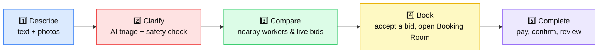
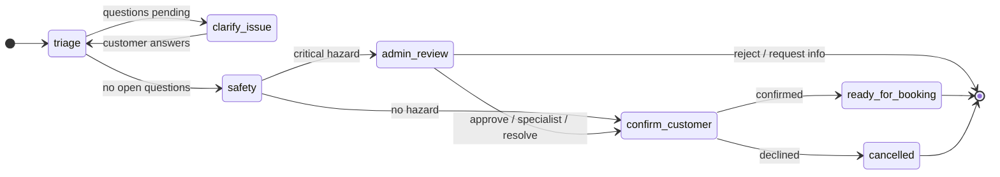
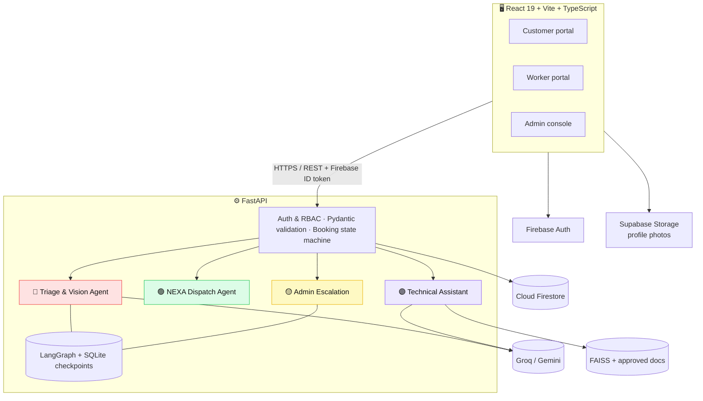
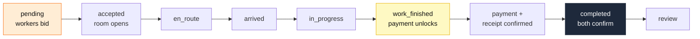

<div align="center">

# 🛠️ KaamFix NEXA

## Agentic AI-Powered Home Services, Dispatch & Trust Platform for Pakistan

### 🛠️ *From “my water motor isn't working” to the right professional at your door.*

Describe the problem · get AI-assisted triage · compare live bids from nearby workers · track the job to completion.<br/>
**Hazardous requests are always routed to a human before anyone is dispatched.**

<br/>

[](https://kaam-fix-agentic-homeservices.vercel.app/)
[](#-developer)
[](#-known-limitations--roadmap)


<br/>

**[Overview](#-overview) · [How It Works](#-how-it-works) · [Features](#-key-features) · [Agents](#-the-nexa-agent-layer) · [Architecture](#-architecture) · [Screenshots](#-screenshots) · [Get Started](#-getting-started) · [Deploy](#-deployment) · [Roadmap](#-known-limitations--roadmap)**

</div>

---

## 📖 Overview

**KaamFix** connects households and small businesses across Pakistan with skilled tradespeople — electricians, plumbers, AC technicians, carpenters, painters, masons, appliance-repair experts and more.

Finding reliable help usually means calling several workers, comparing unclear prices, and explaining a technical fault without knowing its cause. Workers, in turn, need useful information before accepting a job and practical support while doing it.

**KaamFix NEXA** brings all of this into one workflow: *understand the issue → check for risk → find suitable workers → agree on a price → track the service to completion.*

<table>
<tr>
<td align="center" width="25%"><h3>3</h3><sub>role-based portals<br/>customer · worker · admin</sub></td>
<td align="center" width="25%"><h3>4</h3><sub>cooperating agents<br/>triage · dispatch · knowledge · escalation</sub></td>
<td align="center" width="25%"><h3>3</h3><sub>human-in-the-loop<br/>interrupt gates</sub></td>
<td align="center" width="25%"><h3>PKR</h3><sub>local pricing &amp; payments<br/>Easypaisa · JazzCash · bank · cash</sub></td>
</tr>
</table>

### 🎯 The problem → our answer

| Problem | How KaamFix handles it |
|---|---|
| Customer doesn't know what's wrong or which trade to hire | 🤖 **AI triage** turns text + photos into a structured, confirmed issue |
| Dangerous jobs dispatched like ordinary calls | 🛑 **Hazard gate** pauses the workflow until an **admin** reviews it |
| Opaque pricing | 💬 **Live bidding** in PKR — workers submit price + ETA, the customer chooses |
| Unverified workers | ✅ Admin moderation, verified flag, ratings & reviews |
| No technical support on site | 📚 **Technical Assistant** — RAG over *approved* manuals with page citations |
| Payment disputes | 🧾 Proof-based manual PKR payments, receipt confirmation, dual completion |

---

## 🧭 How It Works



1. **Describe the problem.** Choose a service or explain the issue in your own words; attach photos when helpful.
2. **Clarify the request.** AI structures the issue, asks follow-up questions and flags potential hazards for review.
3. **Compare nearby professionals.** Explore the map and review worker profiles, bids, prices and arrival estimates.
4. **Book and coordinate.** Accept a bid and use the Booking Room for messages, updates and job progress.
5. **Confirm and review.** Record payment, confirm receipt and completion, and leave a rating.

---

## ✨ Key Features

<table>
<tr>
<td width="33%" valign="top">

### 👤 Customer
- Email/password & Google sign-in
- **AI triage** with up to 3 photos
- **AI Service Advisor** — quick cost / urgency / safety guidance
- **NEXA Radar** — map booking with radius & budget
- **Live bids** with auto-refresh
- **Booking Room** — timeline, text + image chat, payment
- Easypaisa · JazzCash · bank · cash, with proof upload
- Ratings, reviews, notifications, history

</td>
<td width="33%" valign="top">

### 🧰 Worker
- Onboarding: trade, city, experience, PKR rate, bio, photo
- **Available / Busy / Offline** toggle + live location
- Lead feed with one-tap bidding (price, ETA, message)
- Job steps: *journey → arrived → start → finish*
- **Technical Assistant** *(verified workers)* — cited, document-grounded checks
- Receipt confirmation & earnings view

</td>
<td width="33%" valign="top">

### 🛡️ Admin
- Worker roster: approve / reject / suspend / verify
- **Escalation Queue** — *approve · require specialist · request info · reject · resolve*
- Global requests & payments, proof access
- Analytics (Recharts) & notifications

</td>
</tr>
</table>

---

## 🤖 The NEXA Agent Layer

| | Agent | What it does | How it stays safe |
|---|---|---|---|
| 🔴 | **Triage & Vision** | Converts text + photos into a validated `TriageOutput` (category, urgency, symptoms, visible observations, possible causes, ≤3 questions, hazard flags) | Separates *reported symptoms* from *strictly visible observations*; causes are hypotheses only; never claims a photo proves safety; never gives hazardous repair steps |
| 🟢 | **NEXA Dispatch** | Finds approved, online workers in the right category within a radius and ranks them | Deterministic & explainable: `matchScore = max(0, 100 − 3·km) + min(3·rating, 15)` using haversine distance |
| 🟣 | **Technical Assistant** | Gives the assigned worker checks, tools/parts, safety warnings and stop conditions | Uses **only approved documents**; every source carries file, page, section & score; escalates when the worker isn't verified or evidence is weak |
| 🟡 | **Admin Escalation** | Holds hazardous workflows for human review and resumes them on decision | Records reason, reviewer & timestamp; critical hazards can never skip review |

**Orchestration.** The triage workflow is a [LangGraph](https://github.com/langchain-ai/langgraph) `StateGraph` with three `interrupt()` points (customer clarification, admin review, customer confirmation). State is checkpointed in SQLite, so workflows survive restarts, and retrying a confirmed workflow can't create a second booking. Firestore `requests` stays the single source of truth for bookings.

**Fallback paths.** Groq → Gemini → rule-based triage; FAISS → built-in safety knowledge base. These reduce reliance on a single AI provider. The safety fallback does not replace equipment-specific documentation.

> **What makes it agentic?** The workflow keeps state across steps, pauses for customer or admin input, uses retrieval and dispatch logic, and resumes toward a confirmed booking. Worker ranking itself is a deterministic scoring formula.



---

## 🏗️ Architecture



The Docker deployment uses a single FastAPI service to serve both `/api/*` and the built React app from the same origin.

### 🔄 Booking Lifecycle



Side states: `rejected` · `cancelled` · `disputed`. Illegal transitions return **HTTP 409**. Payment unlocks only at `work_finished`. Accepting a bid marks the worker busy and rejects competing bids.

---

## 🧰 Tech Stack

| Layer | Technology |
|---|---|
| 🎨 **Frontend** | React 19, TypeScript, Vite 6, Tailwind CSS v4, Motion, react-router-dom 7, Recharts, Leaflet / react-leaflet |
| ⚙️ **Backend** | FastAPI, Uvicorn, Pydantic v2, pydantic-settings, Firebase Admin |
| 🤖 **Agents** | LangGraph (`StateGraph`, `interrupt`, `Command`), SQLite checkpointer |
| 🧠 **LLMs** | Groq (structured reasoning), Google Gemini (vision, embeddings, fallback) |
| 📚 **Retrieval** | LangChain, Gemini embeddings (`gemini-embedding-001`), FAISS, PyPDF |
| 🗄️ **Data & Auth** | Cloud Firestore, Firebase Authentication, Supabase Storage |
| 🚢 **Deployment** | Docker (Node 22 build → Python 3.12 runtime), Render blueprint; Vercel config included |

---

## 📸 Screenshots

<div align="center">

**🏠 Landing Page**


</div>

<br/>

<table>
<tr>
<td align="center" width="50%"><b>🔐 Sign-up Modal</b><br/><br/></td>
<td align="center" width="50%"><b>👤 Customer Dashboard</b><br/><br/></td>
</tr>
<tr>
<td align="center"><b>🧰 Worker Dashboard</b><br/><br/></td>
<td align="center"><b>🧰 Worker Dashboard — Leads &amp; Bidding</b><br/><br/></td>
</tr>
<tr>
<td align="center"><b>🛡️ Admin Dashboard</b><br/><br/></td>
<td align="center"><b>🧠 AI Service Advisor</b><br/><br/></td>
</tr>
</table>

---

## 📁 Project Structure

```text
KaamFix-Agentic-Homeservices/
├── app.py                      # Unified entrypoint: FastAPI API + built SPA
├── backend/
│   ├── app/
│   │   ├── main.py             # REST routes (marketplace, booking room, payments, agents)
│   │   ├── agent_service.py    # LangGraph triage workflow + Technical Assistant
│   │   ├── nexa_rag.py         # FAISS retrieval + built-in safety knowledge fallback
│   │   ├── auth.py             # Firebase token verification + role guards
│   │   ├── models.py           # Pydantic request models
│   │   ├── config.py           # Settings (env-driven)
│   │   └── firebase.py         # Firebase Admin init
│   ├── scripts/
│   │   ├── ingest_docs.py      # Build the approved-document FAISS index
│   │   └── start_production.py # Seed data + start the server
│   └── requirements.txt
├── src/
│   ├── components/             # Customer, Worker, Admin UIs, NexaRadar, BookingRoom,
│   │                           # TechnicalAssistant, EscalationQueue, PaymentCheckout …
│   ├── lib/                    # dbService, firebase, supabase, authenticatedFetch
│   ├── App.tsx                 # Routing (/app, /pro, /admin)
│   └── types.ts
├── data/
│   ├── approved-docs/          # Administrator-approved manuals (PDF / TXT / MD)
│   └── faiss/                  # Generated vector index + manifest
├── api/                        # Vercel serverless entrypoints (alternative deploy)
├── screenshots/
├── Dockerfile
├── render.yaml                 # Render blueprint (persistent disk at /app/data)
├── firestore.rules             # Firestore security rules (default deny)
├── .env.example
└── DEPLOYMENT.md
```


---

## 🚀 Getting Started

### Prerequisites

| Requirement | Notes |
|---|---|
| **Node.js 22+** & npm | Frontend build |
| **Python 3.12+** | Backend & agents |
| **Firebase project** | Authentication + Firestore, plus a service-account JSON (*Project settings → Service accounts*) |
| **Gemini API key** | Vision, embeddings, fallback text |
| **Groq API key** *(optional)* | Preferred structured reasoning |
| **Supabase project** *(optional)* | Profile-photo storage |

### Quick start

```bash
# 1 · Clone
git clone https://github.com/subi2222/KaamFix-Agentic-Homeservices.git
cd KaamFix-Agentic-Homeservices

# 2 · Configure (fill in the values — see Environment Variables)
cp .env.example .env
cp backend/.env.example backend/.env   # if supplied in your checkout

# 3 · Install
npm install
python -m venv .venv
source .venv/bin/activate              # Windows PowerShell: .venv\Scripts\Activate.ps1
pip install -r backend/requirements.txt
```

> 🔒 **Never commit** `.env`, `backend/.env` or your Firebase service-account JSON.

### Run in development

Two terminals — Vite proxies `/api` to the backend on port 8000:

```bash
# Terminal 1 — backend
python app.py

# Terminal 2 — frontend (hot reload)
npm run dev
```

Open the URL Vite prints (usually `http://localhost:5173`). Interactive API docs: `http://127.0.0.1:8000/docs`.

### Run the production build locally

```bash
npm run lint
npm run build
python app.py        # serves API + built SPA at http://localhost:8000
```

### Create an admin

Sign up normally, then set that user's `role` field to `admin` in the Firestore `users` collection. Workers appear in matches and can bid only after an admin sets their status to `approved`.

---

## 🔐 Environment Variables

#### Backend — secrets, server-side only (never use a `VITE_` prefix)

| Variable | Description |
|---|---|
| `FIREBASE_PROJECT_ID` | Firebase project ID (must match the frontend) |
| `FIREBASE_SERVICE_ACCOUNT_JSON` | Full service-account JSON as one value (hosted) |
| `GOOGLE_APPLICATION_CREDENTIALS` | Path to the service-account file (local alternative) |
| `GEMINI_API_KEY` | Gemini key for vision, embeddings and fallback text |
| `GEMINI_MODEL` | Gemini model name |
| `GEMINI_EMBEDDING_MODEL` | Embedding model (`models/gemini-embedding-001`) |
| `GROQ_API_KEY` | Groq key (preferred for structured reasoning) |
| `GROQ_MODEL` | Groq model (default `openai/gpt-oss-20b`) |
| `FRONTEND_ORIGINS` | Comma-separated exact origins for CORS |
| `KAAMFIX_DATA_DIR` | Persistent data directory (e.g. `/app/data`) |
| `ENVIRONMENT` | `development` or `production` |


#### Frontend — public build configuration

```env
VITE_FIREBASE_API_KEY=
VITE_FIREBASE_AUTH_DOMAIN=
VITE_FIREBASE_PROJECT_ID=
VITE_FIREBASE_STORAGE_BUCKET=
VITE_FIREBASE_MESSAGING_SENDER_ID=
VITE_FIREBASE_APP_ID=
VITE_FIREBASE_MEASUREMENT_ID=

# Optional — profile photo uploads
VITE_SUPABASE_URL=
VITE_SUPABASE_ANON_KEY=
```


> **Note:** Variables prefixed `VITE_` are embedded in the browser bundle. Firebase web configuration and the Supabase anon key are public client configuration; access must be controlled through authentication and database/storage rules. Keep Gemini/Groq keys, Supabase service-role keys and Firebase Admin credentials server-side only.

---

## 📚 Approved Documents (RAG)

Equipment-specific guidance should be grounded in administrator-approved documents. **No manuals are bundled — add your own.** A built-in safety knowledge base provides fallback guidance when document retrieval is unavailable.

**1 · Add files** — put `.pdf`, `.txt` or `.md` files in `data/approved-docs/`.

**2 · *(Optional)* Add citation metadata** — a sidecar `<filename>.<ext>.json`:

```json
{
  "title": "Approved AC Service Manual",
  "equipment": "Split air conditioner",
  "model": "MODEL-123",
  "version": "2026.1",
  "section": "Electrical troubleshooting"
}
```

**3 · Build the index**

```bash
python -m backend.scripts.ingest_docs data/approved-docs
```

Chunks are 900 characters with 120 overlap; each source gets a SHA-256-derived id; rebuilding replaces the index so duplicates can't accumulate. Only add documents you have the right to use.

---

## 🔌 API Overview

All protected routes expect `Authorization: Bearer <Firebase ID token>`. Full interactive docs at `/docs`.

| Area | Endpoints |
|---|---|
| **System** | `GET /api/health` · `GET /api/agents/status` |
| **Triage agent** | `POST /api/agents/triage` · `POST /api/agents/workflows/{id}/clarify` · `POST /api/agents/workflows/{id}/confirm` · `GET /api/agents/workflows/{id}` |
| **Admin escalation** | `GET /api/admin/escalations` · `POST /api/admin/escalations/{id}/decision` |
| **Dispatch** | `POST /api/agent/dispatch` · `GET /api/radar` · `PATCH /api/location` |
| **Requests & bids** | `GET/POST /api/requests` · `PATCH /api/requests/{id}/status` · `GET/POST /api/requests/{id}/bids` · `POST /api/requests/{id}/bids/{workerId}/accept` |
| **Booking room** | `GET /api/requests/{id}/room` · `POST /api/requests/{id}/transition` · `GET/POST /api/requests/{id}/messages` · `POST /api/requests/{id}/confirm-completion` |
| **Technical assistant** | `POST /api/requests/{id}/technical-assistant` · `GET /api/requests/{id}/technical-sources/{sourceId}` |
| **Payments** | `GET/POST /api/payments` · `POST /api/payments/{id}/confirm-receipt` · `GET /api/payments/{id}/proof` |
| **Workers & reviews** | `GET /api/workers` · `PATCH /api/workers/me` · `PATCH /api/workers/{id}/moderation` · `GET /api/workers/{id}/reviews` · `POST /api/reviews` |
| **Users & notifications** | `GET/PATCH /api/users/me` · `GET /api/users` · `GET /api/notifications` · `PATCH /api/notifications/{id}/read` |
| **Legacy advisor** | `POST /api/advisor` |


---

## 🛡️ Security & Human Oversight

| | |
|---|---|
| 🔑 **Authentication** | Firebase ID-token verification on every protected route; expired/revoked tokens → `401`; JWT-shaped strings are redacted from logs |
| 👥 **Access control** | Role-based (`customer` / `worker` / `admin`) enforced server-side; bookings visible only to their customer, assigned worker and admins |
| 🧑‍⚖️ **Human oversight** | Critical hazards pause workflows until an admin decides |
| ✅ **Validation** | Pydantic limits on every payload; image whitelist (JPEG/PNG/WebP) and 5 MB cap |
| 📂 **File safety** | Server-generated filenames and path-traversal guards for payment proofs and chat images |
| 🗝️ **Secret isolation** | API keys and Firebase Admin credentials are server-side only |
| 📜 **Firestore rules** | Default-deny with per-entity validation; alignment with extended booking states remains on the roadmap |
| 🌐 **CORS** | Exact origin allow-list; limited methods and headers; no wildcard with credentials |

> ⚠️ Never commit `.env`, `backend/.env`, a Firebase Admin JSON, logs, `data/agent-checkpoints.sqlite*` or private uploads. If a key has ever been committed or shared, rotate it.

---

## ☁️ Deployment

KaamFix ships as **one Docker web service**: FastAPI serves `/api/*` and the built React app, with a persistent disk at `/app/data` for checkpoints, FAISS index and uploads.

### Render Blueprint

1. **New → Blueprint**, connect this repository — Render reads `render.yaml` and builds the `Dockerfile`.
2. Fill every variable marked `sync: false` (Firebase, Gemini, Groq, `VITE_*`).
3. Set `FRONTEND_ORIGINS` to your final origin, without a trailing slash.
4. Keep the persistent disk mounted at `/app/data`.
5. Add the deployed domain to **Firebase Authentication → Settings → Authorized domains**.

### ✅ Post-deployment checks

- [ ] `/api/health` returns `status: ok`
- [ ] Customer login, text triage and photo triage work
- [ ] A `401` triggers exactly one Firebase token refresh and retry
- [ ] Technical Assistant is restricted to the assigned job
- [ ] Admin decisions resume paused workflows
- [ ] A restart preserves checkpoints and uploads
- [ ] Logs contain no tokens, API keys or private keys

See [`DEPLOYMENT.md`](./DEPLOYMENT.md) for the full guide. A `vercel.json` and `api/` entrypoints are included for alternative Vercel-based setups. Stateful checkpoints and local uploads require a persistence strategy when adapting this architecture to serverless hosting.

---

## 🧭 Known Limitations & Roadmap

<table>
<tr>
<td valign="top" width="50%">

**⚠️ Current MVP limitations**

- No automated test suite yet
- Payments are manual (proof screenshot + worker confirmation) — no gateway, escrow or refunds
- Payment proofs and chat images are stored on local disk
- SQLite checkpoints and local FAISS tie the service to a single instance
- The legacy `/api/advisor` endpoint is unauthenticated
- Firestore rules predate the extended booking lifecycle (`en_route`, `arrived`, `work_finished`)

</td>
<td valign="top" width="50%">

**🗺️ Roadmap**

- [ ] pytest suite for hazard routing, dispatch maths, state machine & RAG grounding + CI
- [ ] Payment-gateway integration with escrow and refunds
- [ ] Private object storage with signed URLs
- [ ] Postgres checkpointer & managed vector store
- [ ] Auth + rate limiting for the advisor endpoint
- [ ] Align Firestore rules with the full lifecycle + rule tests
- [ ] Worker KYC: documents & trade certificates
- [ ] Urdu-language triage and UI
- [ ] Agent evaluation harness & MCP tool servers

</td>
</tr>
</table>

---

## 📄 Documentation

| | |
|---|---|
| 📘 **Product Requirements Document** | Planned location: `docs/KaamFix_NEXA_PRD.pdf` — add the PDF before linking it |
| 🚢 [`DEPLOYMENT.md`](./DEPLOYMENT.md) | Deployment guide |
| ⚙️ [`backend/README.md`](./backend/README.md) | Backend & agent setup |

---

## 🤝 Contributing

Contributions are welcome.

1. Fork the repository and create a branch: `git checkout -b feature/your-feature`
2. Make your changes; run `npm run lint` and `npm run build`
3. Commit with a clear message and open a pull request

Please do not include secrets, service-account files or unlicensed documents in a PR.

---

## 👨‍💻 Developer

<table>
<tr>
<td>

**Abdul Subhan**<br/>
Developer of **KaamFix NEXA** — Agentic AI-Powered Home Services, Dispatch & Trust Platform for Pakistan.<br/><br/>
[](https://www.linkedin.com/in/abdul-subhan-developer)

</td>
</tr>
</table>

---

## 📜 License

This draft proposes the **MIT License**. Add a corresponding `LICENSE` file to the repository before presenting the project as MIT-licensed. Any existing license and required third-party notices must be preserved.

<div align="center">

**Developed by Abdul Subhan · Built for Pakistan's homes and skilled workforce.**

</div>
